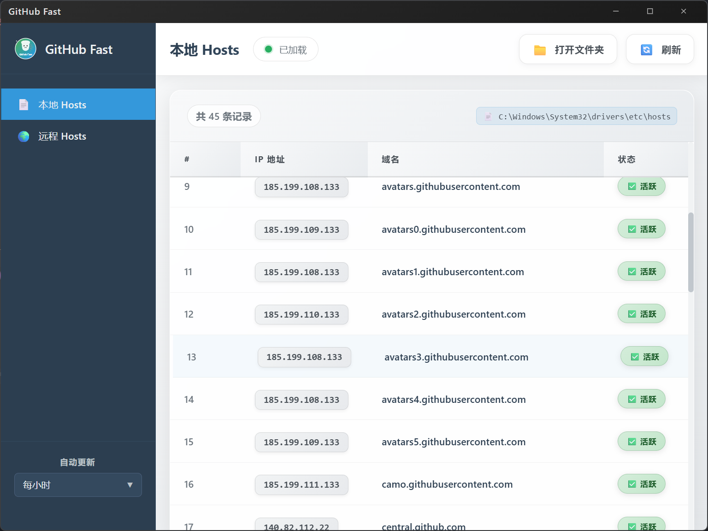

# GitHub Fast 🚀

一个现代化的 GitHub Hosts 文件管理工具，帮助您快速访问 GitHub 及其相关服务。


## 📸 应用截图

### 本地 Hosts 管理



### 远程 Hosts 获取


## ✨ 功能特性

- 🔍 **双源管理**：支持本地和远程 hosts 文件查看
- 🌐 **网络获取**：自动从可靠源获取最新的 GitHub hosts 配置
- ⚡ **一键应用**：快速将远程 hosts 配置应用到本地系统
- 🔄 **自动更新**：支持定时自动更新（每小时/3 小时/6 小时/12 小时/每天）
- 💾 **智能备份**：自动备份原始 hosts 文件，最多保留 5 个历史版本
- 🖥️ **跨平台**：支持 Windows、macOS 和 Linux
- 🎨 **现代界面**：基于 Vue 3 + TypeScript 的美观用户界面
- 📊 **实时状态**：显示 hosts 条目数量和应用状态

## 🚀 快速开始

### 系统要求

- Windows 10/11, macOS 10.15+, 或 Linux
- 管理员权限（用于修改 hosts 文件）

### 安装

1. 从 [Releases](../../releases) 页面下载适合您系统的安装包
2. 运行安装程序并按照提示完成安装
3. 启动 GitHub Fast

### 使用方法

1. **查看本地 Hosts**：在左侧选择"本地 Hosts"查看当前系统的 hosts 文件
2. **获取远程 Hosts**：选择"远程 Hosts"获取最新的 GitHub hosts 配置
3. **应用配置**：点击"应用到本地"按钮将远程配置应用到系统
4. **设置自动更新**：在侧边栏底部选择自动更新频率

## 🛠️ 开发环境

### 前置要求

- Go 1.19+
- Node.js 16+
- Wails v2

### 本地开发

```bash
# 克隆项目
git clone <repository-url>
cd githubfast

# 安装依赖
go mod tidy
cd frontend && npm install

# 启动开发服务器
wails dev
```

### 构建

```bash
# 构建生产版本
wails build

# 构建开发版本
wails build -debug
```

## 📁 项目结构

```
githubfast/
├── app.go              # 主应用逻辑
├── hosts.go            # Hosts 文件管理核心功能
├── main.go             # 应用入口
├── wails.json          # Wails 配置文件
├── frontend/           # 前端代码
│   ├── src/
│   │   ├── App.vue     # 主应用组件
│   │   ├── components/
│   │   │   └── Hosts.vue # Hosts 管理组件
│   │   └── assets/
│   │       └── logo.svg  # 应用 Logo
│   └── package.json
├── img/                # 应用截图
│   ├── 本地.png        # 本地 Hosts 界面截图
│   └── 远程.png        # 远程 Hosts 界面截图
└── build/              # 构建配置和资源
```

## 🔧 配置说明

### Hosts 源地址

默认使用 `https://github-hosts.tinsfox.com/hosts` 作为远程 hosts 源，该源提供稳定可靠的 GitHub 相关域名解析。

### 自动更新

支持以下更新频率：

- 关闭自动更新
- 每小时更新
- 每 3 小时更新
- 每 6 小时更新
- 每 12 小时更新
- 每天更新

### 备份策略

- 每次应用新的 hosts 配置前自动备份原文件
- 备份文件命名格式：`hosts.bak-YYYY-MM-DD HH-MM-SS`
- 自动清理，最多保留 5 个备份文件

## 🎯 使用场景

- **开发者**：快速解决 GitHub 访问问题
- **团队协作**：统一团队的 GitHub 访问配置
- **网络受限环境**：在受限网络环境下访问 GitHub
- **学习研究**：为 GitHub 相关学习提供稳定的访问环境

## 🤝 贡献

欢迎提交 Issue 和 Pull Request！

### 贡献指南

1. Fork 本项目
2. 创建您的特性分支 (`git checkout -b feature/AmazingFeature`)
3. 提交您的更改 (`git commit -m 'Add some AmazingFeature'`)
4. 推送到分支 (`git push origin feature/AmazingFeature`)
5. 打开一个 Pull Request

## 📄 许可证

本项目采用 MIT 许可证。详见 [LICENSE](LICENSE) 文件。

## ⚠️ 注意事项

- 修改 hosts 文件需要管理员权限
- 建议在应用新配置前备份重要数据
- 某些杀毒软件可能会误报，请添加信任
- 首次使用建议先备份当前的 hosts 文件

## 🔗 相关链接

- [GitHub 官方](https://github.com)
- [Wails 框架](https://wails.io)
- [Vue.js](https://vuejs.org)

---

**让 GitHub 访问更快速！** 🌟

> 💡 **提示**：如果遇到访问问题，请尝试清除 DNS 缓存或重启网络服务。
